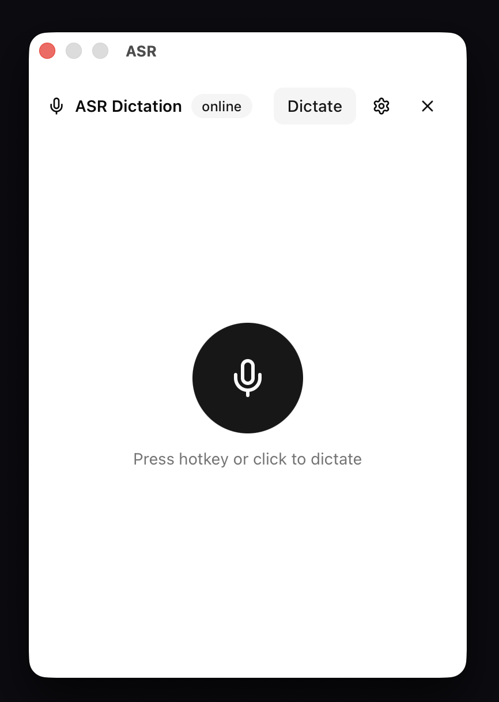
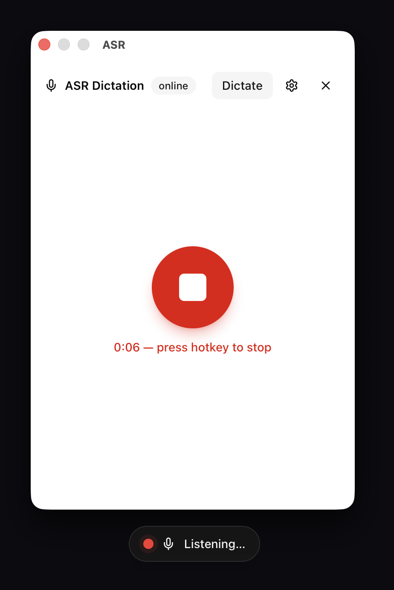
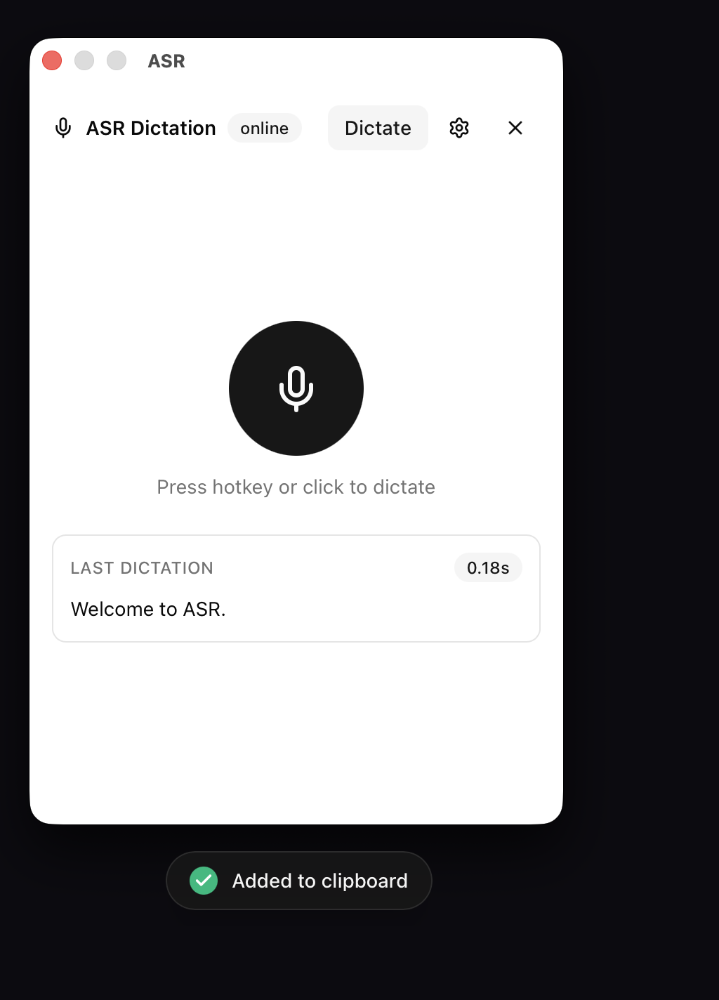

# WhisperFlow Home — macOS Dictation

A menu-bar dictation app for macOS: press a global hotkey anywhere, speak, press again — clean text is pasted at your cursor. No cloud, no subscription, no audio leaving your network.

This repo is the **macOS client**. It pairs with my self-hosted ASR service running on my home AI lab dev box — [Devbox-AI-Lab](https://github.com/JayceDugan/Devbox-AI-Lab) — which runs a local Whisper-class model behind a small HTTP API.


## At a Glance

| The panel — one big button, live status | Dictating — timer + HUD pill at the bottom of the screen | Done — transcript pasted at your cursor, latency badge in the panel |
|---|---|---|
|  |  |  |

## Why This Project Exists

I ran out of weekly word usage on Whispr Flow — a $16/month service I barely use beyond a few hundred words a week. Paying that for convenience I could own myself didn't sit right, so I built the whole pipeline: an ASR server on my home GPU box, and this native client that makes it feel like a system feature.

The result: zero marginal cost, no internet dependency, full ownership of my audio. My voice stays inside my house.

## Use Cases

- **Dictate anywhere** — email in Outlook, issues in GitHub, notes in Obsidian. `⌘⇧Space` starts capture in any focused app; press again and the cleaned transcript is already pasted at the cursor via clipboard + synthesized ⌘V.
- **Hands-free writing while your hands stay on the keyboard** — no window switching, no mode changes. A floating pill at the bottom of the screen shows *Listening… → Transcribing… → ✓ Added to clipboard*, then disappears. It never steals focus from what you're doing.
- **Meetings and long thoughts** — capture runs up to 12 minutes per take with an automatic stop, downmixed and resampled to 16 kHz mono before upload.
- **Messy speech, clean output** — the server optionally strips filler words and self-corrections (`cleanup=true`); the client shows an "uncleaned" badge whenever the server degrades so you always know what you got.
- **A homelab that just works** — the client polls `/healthz`; if the server is cold-booting, the tray icon switches to a "server starting" state and dictation unlocks automatically the moment it's back. No manual reconnects.

## How It Was Built (Agentic)

This app was built almost entirely through **agentic coding**:

- **Model:** Qwen 3.8 Flash Next (Q8), running locally via Unsloth Desktop on the dev box — 180k context, which is what made it viable to hand a single agent the whole codebase plus vendored crate sources and keep coherent across a multi-day build.
- **Harness:** [Oh My Pi (OMP)](https://github.com/can1357/oh-my-pi) as the agent harness — driven with its **goal command** so the agent owned an end-to-end objective ("hotkey → capture → upload → inject, tray shows every phase") and iterated against real evidence until each acceptance criterion passed.
- **Safety layer:** OMPy for type-checking and code-safety passes across the TypeScript side.
- **Method that mattered:** the agent verified the live API contract against the running server before writing any client code, vendored crate sources to check signatures instead of guessing, reproduced every bug (tray icon vanishing, double-fire on click, streams recording silence) with a failing observation first, and committed at each verified milestone.

Total wall time from `create-tauri-app` scaffold to signed `.app` bundle with HUD, Keychain storage, and health monitoring: one working session.

## Technical Architecture

**Design rule: Rust owns everything.** Capture, encoding, networking, secrets, and injection all live in the Tauri backend. The React frontend is presentation-only — it receives a single `asr://status` snapshot event and sends commands back. It never touches audio, HTTP, or tokens.

```
┌─────────────────────── macOS client (this repo) ───────────────────────┐
│  global hotkey ──► flow.rs (single source of truth: phase state machine)│
│       │                │                                                │
│       │                ├─► audio.rs   cpal capture → i16 buffer         │
│       │                ├─► WAV encode (downmix + resample to 16k mono)  │
│       │                ├─► asr.rs      POST /v1/transcribe (reqwest)    │
│       │                ├─► keychain.rs token read at send time          │
│       │                └─► inject.rs   arboard clipboard → synth ⌘V     │
│       │                                                                 │
│  tray.rs (phase glyphs, runtime-drawn template icons)                   │
│  hud.rs  (click-through floating pill: listen/transcribe/done/fail)     │
│  health monitor (5s /healthz poll → phase transitions)                  │
└───────────────────────────────┬─────────────────────────────────────────┘
                                │ multipart WAV, LAN only
                    ┌───────────▼───────────────┐
                    │  Devbox-AI-Lab  asr-api   │
                    │  GET  /healthz            │
                    │  POST /v1/transcribe      │
                    │  local ASR model + cleanup│
                    └───────────────────────────┘
```

### Client (this repo)

- **Tauri 2 + React 19 + Tailwind v4 + shadcn/ui.** One JS bundle serves two windows: the tray panel and the floating HUD.
- **`flow.rs`** is the only phase vocabulary (`idle / recording / processing / error / serverStarting`). Tray icon, tooltips, menu labels, HUD state, and the React snapshot are all derived from it — no parallel enums.
- **Audio:** `cpal` capture with a candidate-config fallback chain (exact 16 kHz mono → nearest supported mono → device default), downmix + linear resample at stop, hand-rolled WAV header. Self-caps at 720s rather than letting the server 413 you.
- **Injection:** transcript → `arboard` clipboard → 60 ms settle → synthesized ⌘V via CoreGraphics event tap. Requires Accessibility permission; the panel detects and walks you through it. Injection failure never loses the transcript — it's kept in the last-result card.
- **Secrets:** API token lives only in the macOS Keychain (`security-framework`). The webview gets a `hasToken` boolean — the value never crosses IPC.
- **Resilience:** typed error mapping (401→Auth, 413→TooLong, 502/504→one auto-retry after 2s, refused→Offline); cached-health gating so the hotkey path adds zero probe latency; generation-counted HUD timers.
- **Latency:** warm round-trip (stop → pasted) is well under a second against the dev box — typically ~200 ms server-side (`asr ≈ 103 ms`, `cleanup ≈ 75 ms`).

### Server side ([Devbox-AI-Lab](https://github.com/JayceDugan/Devbox-AI-Lab))

Small HTTP API on the rig: `POST /v1/transcribe` takes a multipart `file` (plus optional `cleanup=true`) and returns `{ text, raw_text, cleanup_applied, timings_ms: { asr, cleanup, total } }`, with a `warning` field when cleanup degrades. `GET /healthz` for liveness. Runs the ASR model locally on the lab GPU; supports WAV/MP3/FLAC. See the repo for deployment details.

## Getting Started

```sh
pnpm install
pnpm tauri dev        # development (see permission note below)
pnpm tauri build      # produces target/release/bundle/macos/ASR.app
```

Requirements: macOS, Rust, Node 20+, pnpm. Point **Settings → Server URL** at your asr-api instance (default `http://devbox:8090`).

### Permissions (read this)

Run the **built `.app`**, not `pnpm tauri dev`, if you want permission prompts to name *ASR*. A dev-mode bare binary has no bundle identity, so macOS attributes prompts to your terminal and grants don't stick across rebuilds. First run of the bundle asks for:

1. **Microphone** — capture
2. **Accessibility** — synthesizing ⌘V (the Settings tab detects this and links straight to the pane)

Copy `ASR.app` to `/Applications` *before* granting, so grants key against its final path. The build is ad-hoc signed; a rebuild changes the cdhash and resets grants. For a permanent fix, configure a codesigning identity in `tauri.conf.json`.

## Repo Layout

```
src-tauri/src/
  flow.rs      phase state machine — the heart of the app
  audio.rs     cpal capture, downmix/resample, WAV encoding
  asr.rs       HTTP client, retry policy, response types
  inject.rs    clipboard + synthesized paste, AX trust checks
  keychain.rs  Keychain read/write/delete
  tray.rs      menu-bar icon (drawn at runtime), menu, tooltips
  hud.rs       floating click-through overlay window
  config.rs    persisted config (server URL, hotkey, cleanup)
src/
  App.tsx      label-based branch: panel vs HUD
  hooks/       useAsrClient (context + events), useServerHealth
  components/  RecordingIndicator, StatusBanner, SettingsPanel, Hud
```

## Privacy Model

Audio goes to exactly one place: the ASR server URL you configure — on your LAN by default. No telemetry, no analytics, no third-party endpoints. The transcript lands in your clipboard and your Keychain holds only an optional bearer token. That's the entire data surface.
